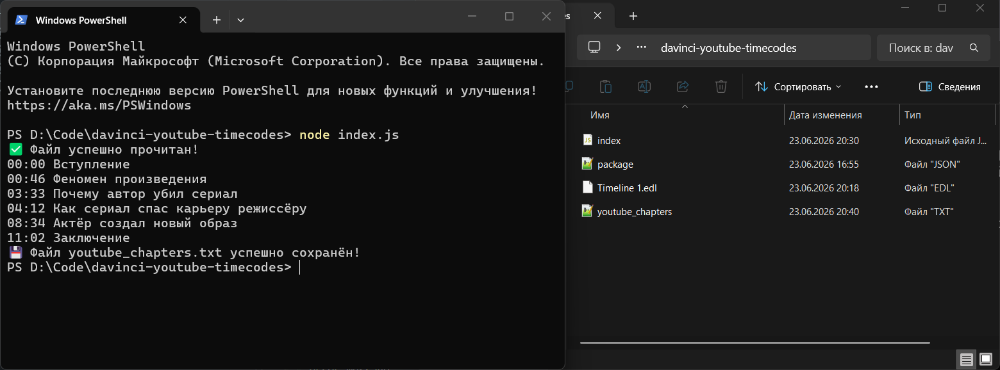

# ✨ Скрипт для переноса таймкодов из DaVinci Resolve в YouTube

---

## 🎯 Алгоритм работы:

### 1. В Davinci Resolve:

1. Расставить маркеры (Markers) на таймлайне и подписать их
2. Нажать правой кнопкой мыши на таймлайн в `MediaPool` → `Timeline` → `Export` → `Timeline Markers to EDL`. Сохранить файл под именем Timeline 1.edl в папку со скриптом

### 2. В Проводнике:

1. Скачать репозиторий
2. Запустить терминал в папке проекта
3. Прописать `node index.js` для запуска скрипта
4. Скрипт мгновенно обрабатывает файл и создаёт готовый файл с таймкодами `youtube_chapters.txt`

---

### 🛠 Технологии:

- JavaScript (ES6+)
